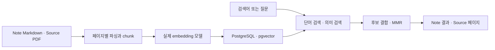

# 지식 팔레트 작업 내역

## 이번 작업의 기준

- 시작: 2026-10-06 23:29 KST. 마감: 2026-10-07 07:00 KST.
- 현재 상태: Phase 1·2 완료 및 main 머지/push. Phase 3 구현 중 opencode의 `provider.quota` 오류로 중단했다. 전체 MVP는 아직 완료되지 않았으며 Phase 4·5·6은 착수하지 않았다.
- 기획: `docs/knowledge-palette-plan.md`, 범위/순서: `docs/knowledge-palette-mvp-scope.md`, 구조: `docs/knowledge-palette-architecture.md`.
- Codex는 문서 검토, 구현 계획, 결과 검토, 검증과 Git 작업을 맡는다. 애플리케이션 코드 작성/수정은 `opencode run`에 위임한다.
- Python 의존성은 프로젝트 가상환경에 설치한다. `.venv`, `node_modules`, 빌드 결과물, 캐시, `.env`와 API 키 등 로컬 설정은 Git에서 제외하고 실제 제외 여부를 검토한다(사용자 추가 요청).
- 각 단계 시작 전에 현재 시각과 예상 소요 시간을 확인한다. 구현·검토·커밋·머지·push가 오전 7시 전에 끝나기 어렵다고 판단하면 다음 단계는 시작하지 않는다.
- opencode 모델의 한도/크레딧 소진이 확인되면 추가 구현 호출을 중단한다. 완료된 작업과 미완료 상태를 기록하고 push한다. 실제 토큰 수가 없으면 호출 수와 출력량을 대략적 작업량으로 기록한다.
- 브랜치는 `feat/구현-내용`, 커밋은 Conventional Commits를 사용한다. 각 단계 검토 후 main에 머지하며, 미완료 단계는 구현 브랜치에 보존한다.

## 검토 순서와 용어

1. 이 문서의 각 Phase에서 완료 범위·검증 결과·남은 작업을 먼저 확인한다.
2. `README.md`의 실행 순서대로 앱을 띄워 예제 Workspace로 기능을 확인한다(구현 후 추가).
3. `docs/knowledge-palette-architecture.md`의 단계별 구현 결정을 읽는다. 기획을 코드로 옮기면서 선택한 구체적 동작을 설명한다.
4. 해당 Phase의 핵심 파일을 UI → API → 파일/검색 처리 순서로 읽는다. 정확한 경로와 읽는 이유는 단계 완료 시 아래에 기록한다.

**Workspace**는 앱이 읽고 쓰는 로컬 폴더다. **Note**는 사용자의 생각을 담은 `notes/`의 Markdown 파일이고, **Source**는 `sources/`의 원본 참고 자료다. **frontmatter**는 Markdown 맨 위의 YAML 메타데이터이며, **wikilink**는 `[[파일명]]` 형태의 연결이다. **backlink**는 현재 Note를 링크한 다른 Note의 목록이다. 검색용 DB와 embedding(문장의 의미를 숫자 배열로 바꾼 값)은 원본으로부터 다시 만드는 파생 데이터다.

## Phase 1 — Local Wiki

### 기능/단계 1: 초기 구성과 로컬 위키

- 브랜치: `feat/local-wiki`.
- 착수 시각: 2026-10-06 23:29 KST. 구현·검토 예상 60~90분으로 오전 7시 전에 완료 가능하다고 판단.
- 시작 상태: 애플리케이션 코드 없이 문서와 작업/테스트 규칙만 존재.
- 위임 범위: Vue 3 + TypeScript, FastAPI, Workspace 열기/생성, 실제 Markdown 읽기/쓰기와 자동 저장, Markdown 미리보기, frontmatter 보존, 파일명 기준 링크/자동완성, backlink, 제목/본문 검색.
- 후속 단계 관계: PDF·embedding·pgvector는 Phase 2, 대화는 Phase 3, 지식 자동 갱신은 Phase 4, 변경 기록/Undo는 Phase 5에서 구현한다. Phase 1 완료는 전체 MVP 완료를 뜻하지 않는다.
- opencode 구현 호출 #1: 초기 구현 완료. Backend 테스트 2개, Frontend 타입 검사·빌드 통과(opencode 보고). Python은 `backend/.venv`를 사용한다.
- 검토에서 자동 저장 실패 후 전환 시 유실, 겹치는 저장/노트 읽기 요청, Workspace 전환 시 저장 누락, 중복 파일명 자동완성, 최종 HTML 문자열을 치환하는 링크 처리와 symlink 검색 경계 누락을 발견했다. 초기 통과 결과만으로 완료 처리하지 않고 수정 위임했다.
- 기능/단계 2: 2026-10-06 23:37 KST, opencode 호출 #2로 검토 수정 착수. 예상 구현·재검토 30~45분으로 마감 전에 완료 가능. `.env` 등 Git 제외 보완도 포함한다.
- 기능/단계 3: 2026-10-06 23:44 KST, opencode 호출 #3로 남은 검토 사항 수정 착수. 예상 20~30분으로 마감 전에 완료 가능. 저장 중 이전 내용으로 되돌린 뒤 전환하는 경우, 전환 중 편집, notes 폴더 자체의 symlink 경계, 중첩 Workspace의 `.palette` Git 제외를 보완한다.
- 기능/단계 4: 2026-10-06 23:50 KST, opencode 호출 #4로 저장 대기 재확인, 루트 중복 파일의 `./` 자동완성, 오래된 backlink 응답 표시와 문서 순서를 소폭 수정. 예상 10~15분으로 마감 전에 완료 가능.
- Codex 직접 검증(호출 #3 후): `backend/.venv/bin/python -m pytest -q` → **3 passed**, 실제 Python 실행 경로도 `backend/.venv/bin/python`임을 확인. `frontend`에서 `npm run build` → 타입 검사와 빌드 통과. 제한된 실행 환경에서는 FastAPI TestClient가 멈춰 해당 프로세스를 종료하고 정상 실행 권한으로 재검증했다. 테스트 라이브러리의 httpx 관련 deprecation warning 1건은 실패가 아니다.
- 호출 #3은 중간에 provider의 모델 출력 파싱 오류(HTTP 500 계열)를 기록하고도 이후 수정·검증과 최종 보고를 완료했다. CLI 종료 코드는 1이었다. **한도/크레딧 소진 오류는 아니므로** 같은 모델로 후속 검토 수정을 진행했다.

### Phase 1 완료 내용과 검토 안내

- 완료: 기존 폴더 열기/새 폴더 생성, `notes/`·`sources/` 기본 구조, 중첩 노트 목록/생성/읽기/편집, 실제 Markdown 자동 저장, frontmatter 원본 보존, Markdown 미리보기, wikilink 이동/별칭/자동완성, backlink, 파일명·제목·본문 검색.
- 자동 저장은 입력 후 800ms에 실행한다. 노트/Workspace 전환 때 진행 중인 저장을 기다리고, 저장 실패 시 초안과 현재 노트를 유지한다. 저장/로드 중 전환 작업을 잠그며, 미저장 상태로 창을 닫으려 하면 경고한다. 창 닫기 자체가 저장 완료를 보장하지는 않는다.
- 링크는 파일명 기준이다. 이름이 중복되면 `[[sub/이름]]`, 루트 파일은 `[[./이름]]`으로 구분한다. 본문 `# 제목`은 링크 주소가 아니다. 없는 대상은 안내하며 자동 생성하지 않는다. 미리보기의 코드 예제 안에서는 링크를 렌더링하지 않는다.
- `.venv`와 로컬 캐시·`.env`·중첩 `.palette`는 제외한다. `uv.lock`과 `package-lock.json`은 함께 버전 관리해 같은 의존성을 설치할 수 있게 한다.
- 최소 검증: backend 테스트 3개(위키 성공 경로, 파일명 링크 규칙, Notes 경계와 원본 보호), frontend 타입 검사·production build 통과. 호출 #4 이후에도 opencode가 동일 검증을 통과했다. `git diff --check` 통과.
- 검증 한계: 브라우저의 클릭/키보드/창 닫기 경고를 직접 조작한 검증은 아직 하지 않았다. 완전한 Live Preview, 외부 편집 감지/충돌 처리, AI 기능은 이 단계 범위에 없다.

입문자에게 권하는 검토 순서:

1. `README.md`: 가상환경 설치와 서버 두 개 실행 방법을 확인한다. frontend는 브라우저 화면, backend는 실제 파일을 읽고 쓰는 로컬 서버다.
2. 실행한 앱에서 `/home/hjham/knowledge-palette/example-workspace`를 열고 MMR 노트 → 연결 노트 → backlink → 검색 순서로 살펴본다. 예제 노트를 편집하면 예제 Markdown 파일 자체가 바뀐다.
3. `docs/knowledge-palette-architecture.md` 끝의 Phase 1 결정 사항: 파일명 링크, 중복/없는 링크, 저장 실패, 창 닫기 등 구체적인 동작을 읽는다.
4. `frontend/src/App.vue`: 화면 상태, 편집, 자동 저장과 노트 이동이 연결되는 곳이다. `frontend/src/api.ts`는 화면의 동작을 backend HTTP 요청으로 바꾼다.
5. `backend/app/main.py`: HTTP API, 즉 브라우저가 서버에 요청하는 작업의 입구다. `backend/app/workspace.py`: 실제 폴더와 Markdown, 링크와 backlink·검색을 다룬다. API가 DB 대신 파일을 읽고 쓰는 구조임을 확인한다.
6. `backend/tests/test_phase1.py`: 테스트가 실제 Markdown 저장과 링크 규칙을 어떻게 확인하는지 읽는다. `backend/pyproject.toml`·`frontend/package.json`은 각 언어의 의존성과 실행 명령을 정의한다.

Phase 1 완료는 로컬 위키 완료다. 다음 Phase 2에서 Source와 검색용 DB/embedding을 추가하고, Phase 3부터 대화를 연결한다. 전체 MVP 완료에는 Phase 5의 History/Undo까지 필요하다.

Git 결과: 구현 커밋 `146916e` (`feat: implement local markdown wiki`), main 머지 `6555db2` (`feat: merge local wiki implementation`). `main`과 `feat/local-wiki` 모두 원격 push 완료. Phase 1의 코드·설정·예제는 lockfile을 제외하고 약 1,001줄이며, 구현 CLI 호출 4회, 내부 도구 실행 99회다. 집계 가능한 완료 step 기준 출력 토큰은 합계 50,007이며 최종 보고/실패 step 등의 미표시 사용량은 포함하지 않는다.

## Phase 2 — Source & RAG

### 기능/단계 1: PDF와 재생성 가능한 검색 인덱스

- 브랜치: `feat/source-rag`.
- 착수 시각: 2026-10-06 23:55 KST. Docker·모델 다운로드·구현 검토를 포함해 예상 1~2시간으로 오전 7시 전에 완료 가능하다고 판단.
- opencode 호출 #5는 새 세션에서 현재 코드와 문서를 읽고 구현한다. 모델 변경 없이 단계별 세션만 분리한다.
- 범위: PDF 인식·등록·파싱, 페이지 정보가 있는 chunk, 실제 다국어 embedding, Docker PostgreSQL·pgvector, 단어 검색+의미 검색의 후보 결합, MMR, Notes/Sources 검색 분리, Sources/Search 화면.
- **chunk**는 긴 문서에서 검색할 작은 문단 조각이다. **hybrid search**는 정확한 단어 검색과 의미 검색을 함께 사용하는 방식이다. **MMR**은 관련성이 있으면서도 같은 내용만 반복되지 않도록 검색 후보를 선택한다.
- Source 원본과 Note Markdown은 그대로 원본 저장소로 유지한다. 변환 텍스트·검색 DB·embedding은 다시 만들 수 있는 파생 데이터다.
- 단계 완료 기준: 실제 PDF → 파싱 → embedding → pgvector → hybrid/MMR 검색이 연결되고 원본 자료는 바뀌지 않는다. DB나 모델이 없어도 Phase 1 편집은 계속 가능해야 한다.
- 후속 방향: 이 단계는 Chat에 제공할 검색 기반을 만든다. 실제 Provider/Streaming Chat/인용은 Phase 3에서 연결한다.
- 호출 #5 초기 결과: 실제 다국어 모델 다운로드와 384차원 embedding 생성, Docker PostgreSQL·pgvector healthy, 실제 PDF/Note 색인과 검색, 전체 재구축, 원본 PDF 체크섬 유지 확인(opencode 수행). backend 테스트 4개와 frontend 타입 검사·빌드 통과.
- 모델 결정: 설치한 FastEmbed 0.8.1의 기본 지원 목록에 작은 multilingual E5가 없어, 지원되는 `sentence-transformers/paraphrase-multilingual-MiniLM-L12-v2`를 선택했다. 실제 다운로드·추론을 검증했으며 E5의 `query:`/`passage:` 접두사를 임의로 붙이지 않는다. 이는 제품의 embedding 모델 선택이며 opencode 실행 모델 변경이 아니다.
- 기능/단계 2: 2026-10-07 00:12 KST, 호출 #6 검토 수정 착수. 예상 30~45분으로 마감 전에 완료 가능. 모델 불일치 시 전체 재구축이 막히는 문제, 실패한 전체 재구축이 기존 chunk를 지우는 문제, 오래된 검색 결과 표시, derived 폴더 경계, 모드/Workspace 전환과 설정·UI 안내를 수정한다.
- 호출 #6 결과: 기존 4 테스트와 타입 검사·빌드 통과. 실제 PDF/Note 검색, 같은 모델 전체 재구축, 손상 PDF 실패 후 이전 chunk 유지, Note 수정 후 stale 표시, `.palette` symlink 거부를 임시 Workspace에서 검증했다. 모델 불일치/재구축은 **저장된 모델 metadata를 조작한 흐름 검증**이며 대안 모델 품질 비교가 아니다.
- 기능/단계 3: 2026-10-07 00:24 KST, 호출 #7로 새로고침 후 Workspace 표시, canonical 경로와 백링크 응답의 Workspace 구분, derived 폴더 생성 전 경계 검사, 실행 안내를 소폭 수정. 예상 10~15분으로 마감 전에 완료 가능.

### Phase 2 완료 내용과 검토 안내

- 완료: `sources/`의 PDF/Markdown/텍스트 인식, PyMuPDF 텍스트 파싱, PDF 페이지가 붙은 chunk, 실제 다국어 embedding, Docker PostgreSQL·pgvector 저장, 단어/의미 검색 후보 결합, MMR, Notes/Sources 분리 검색, Search/Sources 화면.
- 기본 모델은 multilingual MiniLM 384차원이다. 현재 스키마는 384차원 모델만 지원한다. 모델명 변경 후에는 전체 재구축이 필요하며 다른 차원은 이 MVP에서 지원하지 않는다.
- 검색 데이터 준비는 Sources 화면에서 사용자가 실행한다. Note 편집 후 의미 검색은 재색인 전까지 이전 내용을 사용할 수 있으므로 Search에서 `재인덱싱 필요`를 표시한다. Phase 1의 파일명/본문 검색은 실제 파일을 바로 읽는다.
- 같은 모델 재구축은 문서별로 교체하고 실패한 문서의 기존 chunk를 유지한다. 모델 변경 재구축은 전체가 성공해야 교체한다. 손상되거나 텍스트가 없는 PDF는 실패로 표시하며 Source를 Note로 바꾸지 않는다.
- `Source` 원본은 바이트가 유지된다. `.palette/derived/`는 다시 만들 수 있는 변환 결과이고 Git에서 제외한다. Notes와 Sources 모두 Workspace별로 구분해 DB에 저장한다.
- Codex 직접 검증(2026-10-07 00:30 KST): 프로젝트 가상환경에서 backend **4 passed**, frontend 타입 검사 포함 **build 성공**, `git diff --check` 통과. 실제 앱 DB 컨테이너를 사용했다. 별도 테스트 DB/컨테이너는 만들지 않았다.
- 검증 한계: 브라우저 UI의 직접 클릭 검증과 대안 embedding 모델의 품질 비교는 하지 않았다. 스캔 이미지 PDF의 OCR은 현재 지원하지 않는다. Chat·지식 자동 갱신·History/Undo는 아직 다음 단계다.

입문자에게 권하는 검토 순서:

1. `README.md`: 루트에서 `.env` 예제를 복사하고 Python 가상환경·npm 의존성·Docker를 준비한 뒤 두 서버를 실행한다. `.env`는 개인 실행 설정이며 Git에 올라가지 않는다.
2. 임시 Workspace의 `sources/`에 일반 텍스트 PDF를 넣고 Sources → 변경분 스캔/인덱싱 → Search 순으로 확인한다. 파일이 발견되는 것과 검색용으로 준비되는 것은 서로 다른 상태다. Note 검색 결과는 클릭해 원본 편집 화면을 연다.
3. `docs/knowledge-palette-architecture.md`의 Phase 2 결정 사항: parser/model 선택, chunk·MMR의 기준, 재구축과 실패 정책을 읽는다.
4. `frontend/src/SourcesView.vue`·`SearchView.vue`: 자료 준비 상태와 검색 결과를 보여준다. `App.vue`는 Notes/Search/Sources 전환과 편집 저장을 연결한다.
5. `backend/app/parsers.py` → `indexer.py`: PDF에서 페이지별 텍스트를 뽑고 검색 조각을 만들어 원본과 다른 위치에 파생 데이터를 저장한다.
6. `backend/app/embeddings.py` → `db.py` → `retrieval.py`: 문장을 실제 모델로 숫자 배열로 바꾸고, pgvector에 넣어 의미 검색하며, 단어 검색 후보와 함께 MMR로 선택한다. embedding은 파일 원본 자체가 아니다.
7. `docker/docker-compose.yml`·`backend/tests/test_phase2.py`: 앱 DB 실행 설정과 실제 PDF/Note 검색의 최소 성공 경로를 확인한다. PDF 체크섬 검증은 원본 바이트가 바뀌지 않았는지 확인한다.

Git 결과: 구현 커밋 `c6af7d2` (`feat: add pdf ingestion and hybrid retrieval`), main 머지 `c270f65` (`feat: merge source and rag implementation`). `main`과 `feat/source-rag` 모두 원격 push 완료.

## Phase 3 — Chat

### 기능/단계 1: Provider와 스트리밍 대화

- 브랜치: `feat/streaming-chat`.
- 착수 시각: 2026-10-07 00:31 KST. 구현·검토 예상 약 1시간으로 오전 7시 전에 완료 가능하다고 판단.
- opencode 호출 #8: 새 세션, 동일 기본 실행 설정으로 구현 위임.
- 범위: 설정 가능한 OpenAI 호환 Provider, streaming Chat, PostgreSQL 대화 보존, 현재 Note와 선택적 Source context, 실제 파일/페이지를 가리키는 인용, Chat 전체 화면과 명시적 Split View.
- **Provider**는 앱이 사용할 LLM 서비스의 주소·모델·인증 설정을 감추는 연결부다. **streaming**은 응답이 완성되기 전에 생성된 부분부터 화면에 보여주는 방식이다. **context**는 답변에 참고하도록 보내는 기존 Note/자료다. **citation**은 답변이 참고한 실제 Note 또는 Source 페이지를 가리킨다.
- 대화는 Workspace별로 보존하고, 중단/실패 응답을 정상 완료로 취급하지 않는다. API 키는 앱 설정에서만 사용하며 UI/작업 로그에 노출하지 않는다.
- 구현 준비에서 `openai-docs` 스킬로 [공식 streaming 규격](https://developers.openai.com/api/reference/resources/chat/subresources/completions/streaming-events)을 확인했다. 호환 API 선택은 여러 Provider를 연결할 수 있도록 하기 위한 것이다.
- 실제 Provider 연결 검증과 모의 외부 API 응답을 이용한 스트림/저장 검증을 구분한다. opencode의 인증 정보를 앱에 복사하지 않는다.
- 후속 방향: 이 단계에서는 Chat이 Markdown을 수정하지 않는다. Knowledge Candidate 추출과 자동 파일 갱신은 Phase 4에서 구현한다.

### Phase 3 중단 — opencode 한도 오류

- 오류: `provider.quota` — `Rate limit exceeded. Please try again later.`
- 오류를 확인한 시각: 2026-10-07 00:48 KST. 요청에 따라 추가 `opencode run` 호출과 모델 변경 없이 구현을 중단했다. 한도의 정확한 종류·잔량·재개 가능 시각은 오류 메시지에 없다.
- 현재 브랜치에 남은 부분 구현: `backend/app/llm.py`의 호환 Provider/스트림 파싱, `chat.py`의 context·대화 저장·응답 생성, DB 대화 테이블과 API 확장, `ChatView.vue`·`NotesView.vue`와 App 분리. 모델 변경 재색인 시 운영 Workspace 행을 삭제하지 않도록 변경한 부분도 있다.
- **완료로 취급하지 않는다.** Phase 3 전용 테스트·설정 예제·사용 안내·전체 검토가 끝나지 않았다. 실제 LLM Provider 호출은 검증하지 않았고 opencode 인증 정보를 사용하지 않았다.
- 중단 후 상태 확인만 수행했다(추가 코드 수정 없음): backend 기존 테스트 **3 passed, 1 failed**. `/api/search/sources` 라우트가 빠져 Phase 2 성공 경로가 실패했다. frontend `npm run build`는 **실패**: `App.vue`의 `modeTitle` 계산에서 `mode`를 컴포넌트 속성으로 찾지 못하는 TypeScript 오류(TS2339)가 있다. `git diff --check`는 통과했다.
- 부분 구현은 `feat/streaming-chat`에 체크포인트 커밋/push한다. 검증된 main에는 미완료 코드를 머지하지 않는다. 중단 기록만 main에도 남기고 작업 디렉터리를 main으로 복귀한다.

재개할 때의 검토·수정 순서:

1. 먼저 main의 Phase 1·2를 `README.md`대로 확인한다. 진행한 기능과 용어는 이 문서의 각 Phase 검토 안내를 읽는다.
2. `feat/streaming-chat`으로 옮겨 `frontend/src/App.vue`의 빌드 오류, `backend/app/main.py`의 Source 검색 라우트 누락부터 수정한다. 원래 기능의 테스트가 다시 통과해야 한다.
3. `backend/app/llm.py`: 테스트만을 위한 `_TRANSPORT` 훅을 제거하고 외부 HTTP 호출 경계에서 테스트한다. 빈 응답·스트림 중간 오류·종료 이유·취소를 정상 완료와 구분하는 처리를 검토한다.
4. `backend/app/chat.py`: 현재 사용자 질문의 중복 입력, reindex의 개별 실패를 무시하는 context 상태, 알려지지 않은 인용 라벨, 동기 검색/DB 처리로 이벤트 루프를 막는 문제, 취소된 generator에서 SSE를 yield하는 문제를 검토한다. 대화와 참조 텍스트가 Workspace별로 보존되는지도 확인한다.
5. `frontend/src/App.vue`·`NotesView.vue`·`ChatView.vue`: 상위 화면 전환 잠금이 Note 편집·로드·생성에도 전달되는지, 화면을 옮겨도 선택 Note·초안과 대화 응답이 유실되거나 섞이지 않는지 검토한다. Split은 사용자가 명시적으로 선택할 때만 연다.
6. 실제 검색/DB를 사용하고 외부 Provider 경계만 대체하는 최소 Chat 성공·중단 테스트, 타입 검사·빌드, 설정 예제와 설명 문서를 완성한다. 모의 응답 검증과 실제 Provider 검증을 구분한다.
7. Phase 3 검토가 끝나면 현재 시각과 오전 7시 조건을 새로 확인하고 Phase 4 → 5 → 6 순으로 이어간다. 한도 오류로 멈춘 이번 실행에서는 재개하지 않는다.

이번 세션 작업량(대략): 약 1시간 20분, 구현/수정용 `opencode run` **8회**, 로그에 기록된 내부 도구 실행 **291회**. 집계 가능한 완료 step의 출력 토큰은 **146,002**이며 일반 입력 **1,139,937**, 캐시 입력 **15,554,432**다. 최종 보고·실패 step 등 미표시 사용량이 있어 전체 청구 사용량으로 단정할 수 없다. Phase 3 신규 코드 파일 4개는 합계 **1,210줄**, 기존 파일 변경은 lockfile을 포함해 약 204줄 추가·403줄 삭제다. 호출 #8 로그는 약 452 KiB다.

## opencode 호출 및 작업량

CLI 사용법 확인은 구현 호출 수에서 제외한다. 원본 실행 로그는 `/tmp/kp-opencode-번호.jsonl`에 보관하며 자격 증명이나 전체 대화를 저장소에 커밋하지 않는다. 아래에 호출별 결과와 출력량을 요약한다.

| 호출 | 목적 | 결과 | 작업량 |
| --- | --- | --- | --- |
| 1 | Phase 1 초기 구현 | 완료, 검토 수정 필요 | 약 7.1분, 도구 38회, JSON 로그 약 220 KiB, 출력 토큰 17,721 |
| 2 | Phase 1 검토 수정·가상환경/Git 제외 보완 | 완료, 남은 문제 재검토 | 약 5.5분, 도구 14회, JSON 로그 약 113 KiB, 출력 토큰 16,597 |
| 3 | Phase 1 최종 저장/전환·파일 경계 수정 | 완료, 중간 provider 파싱 오류 기록 | 약 5.2분, 도구 27회, JSON 로그 약 134 KiB, 출력 토큰 11,958 |
| 4 | Phase 1 작은 최종 검토 수정 | 완료, 기존 테스트·빌드 통과 | 약 2.1분, 도구 20회, JSON 로그 약 70 KiB, 출력 토큰 3,731 |
| 5 | Phase 2 Source & RAG 초기 구현 | 완료, 검토 수정 필요 | 약 14.1분, 도구 83회, JSON 로그 약 424 KiB, 출력 토큰 30,656 |
| 6 | Phase 2 원자적 재구축·검색 상태·UI 검토 수정 | 완료, 최소 검증 통과 | 약 10.7분, 도구 48회, JSON 로그 약 257 KiB, 출력 토큰 25,999 |
| 7 | Phase 2 Workspace 표시·실행 안내 최종 수정 | 완료, 최소 검증 통과 | 약 2.3분, 도구 14회, JSON 로그 약 88 KiB, 출력 토큰 4,950 |
| 8 | Phase 3 Provider·Streaming Chat·인용 부분 구현 | provider.quota로 중단, 빌드/기존 테스트 미통과 | 약 12.6분, 도구 47회, JSON 로그 약 452 KiB, 출력 토큰 34,390 |

토큰은 opencode의 `step_finish.tokens`를 호출별 합산한다. 캐시 입력은 일반 입력과 별도로 기록한다. 도구 실행 결과가 반복해서 포함되는 JSON 로그의 크기는 실제 코드 길이나 모델 출력 토큰과 다르다. 모델 비용 필드가 0이더라도 실제 요금이나 한도 잔량을 알 수 있다는 뜻은 아니다.
